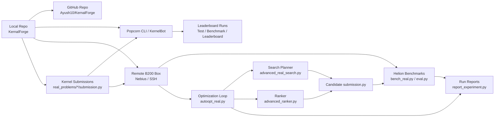
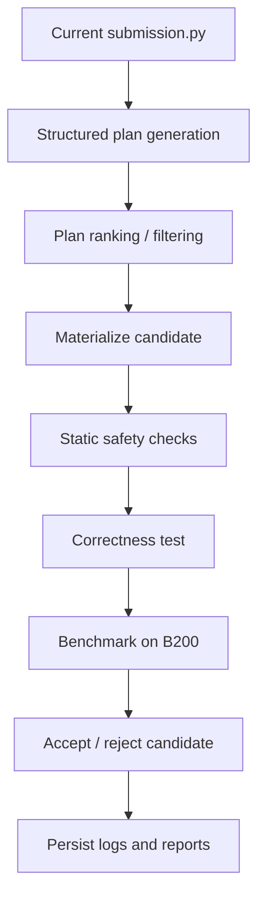
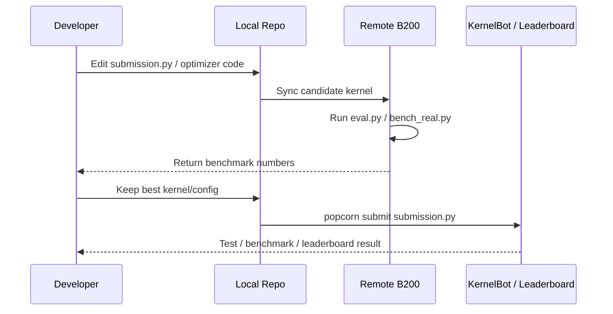

# KernalForge Architecture

This document describes the architecture built in this workspace for the Helion hackathon.

## Overview

KernalForge has two layers:

1. **Leaderboard kernel layer**
   - Final `submission.py` files for each required kernel
   - Hardcoded Helion configs for B200 execution
   - Local and remote B200 benchmarking

2. **Optimization and tooling layer**
   - Structured search and ranking for candidate generation
   - Experiment logging, summaries, and HTML reports
   - Remote GPU benchmarking workflow
   - Submission-ready packaging flow for Popcorn / KernelBot

## System Diagram

## Core Components

- [real_problem_suite.py](/C:/Users/ayush/Desktop/Hackathons/Python%20Helion/new/real_problem_suite.py)
  - Loads and dispatches the real GPU Mode Helion problems.

- [bench_real.py](/C:/Users/ayush/Desktop/Hackathons/Python%20Helion/new/bench_real.py)
  - Runs correctness and benchmark evaluations for the real kernels.

- [autoopt_real.py](/C:/Users/ayush/Desktop/Hackathons/Python%20Helion/new/autoopt_real.py)
  - Main experiment controller.
  - Runs the optimization loop, heartbeat, iteration summaries, and experiment reports.

- [advanced_real_search.py](/C:/Users/ayush/Desktop/Hackathons/Python%20Helion/new/advanced_real_search.py)
  - Generates structured optimization plans.
  - Enforces Helion-safe prompt constraints.
  - Seeds problem-specific search plans.

- [advanced_ranker.py](/C:/Users/ayush/Desktop/Hackathons/Python%20Helion/new/advanced_ranker.py)
  - Scores plans using resource pressure, failure history, and heuristic ranking.
  - Helps filter bad candidates before expensive benchmarking.

- [report_experiment.py](/C:/Users/ayush/Desktop/Hackathons/Python%20Helion/new/report_experiment.py)
  - Produces experiment summaries and HTML reports.

- [summary_tables.py](/C:/Users/ayush/Desktop/Hackathons/Python%20Helion/new/summary_tables.py)
  - Renders compact benchmark/result tables for CLI and reports.

- [real_problems](/C:/Users/ayush/Desktop/Hackathons/Python%20Helion/new/real_problems)
  - Contains the actual leaderboard kernels:
    - `fp8_quant_py/submission.py`
    - `causal_conv1d_py/submission.py`
    - `gated_deltanet_chunk_fwd_h_py/submission.py`
    - `gated_deltanet_chunk_fwd_o_py/submission.py`
    - `gated_deltanet_recompute_w_u_py/submission.py`

## Optimization Flow

## Benchmark and Submission Flow

## Main Competition vs Special Contribution Track

### Main competition

Use the kernel submission files in [real_problems](/C:/Users/ayush/Desktop/Hackathons/Python%20Helion/new/real_problems). These are the artifacts submitted to the leaderboard.

### Special contribution track

The special track is not the kernel files themselves. The most relevant architecture pieces for a future Helion PR are:

- [autoopt_real.py](/C:/Users/ayush/Desktop/Hackathons/Python%20Helion/new/autoopt_real.py)
- [advanced_real_search.py](/C:/Users/ayush/Desktop/Hackathons/Python%20Helion/new/advanced_real_search.py)
- [advanced_ranker.py](/C:/Users/ayush/Desktop/Hackathons/Python%20Helion/new/advanced_ranker.py)
- [report_experiment.py](/C:/Users/ayush/Desktop/Hackathons/Python%20Helion/new/report_experiment.py)

These represent the novel tooling layer:

- compile-aware search
- resource-aware candidate ranking
- Helion-safe candidate filtering
- experiment reporting and diagnostics

## Current Operating Model

1. Tune kernels locally and on the remote B200 box.
2. Keep the best `submission.py` variants in `real_problems/*`.
3. Push stable versions to GitHub.
4. Submit the exact kernel files through Popcorn / KernelBot.
5. Optionally upstream the tooling layer as a Helion ecosystem contribution.
